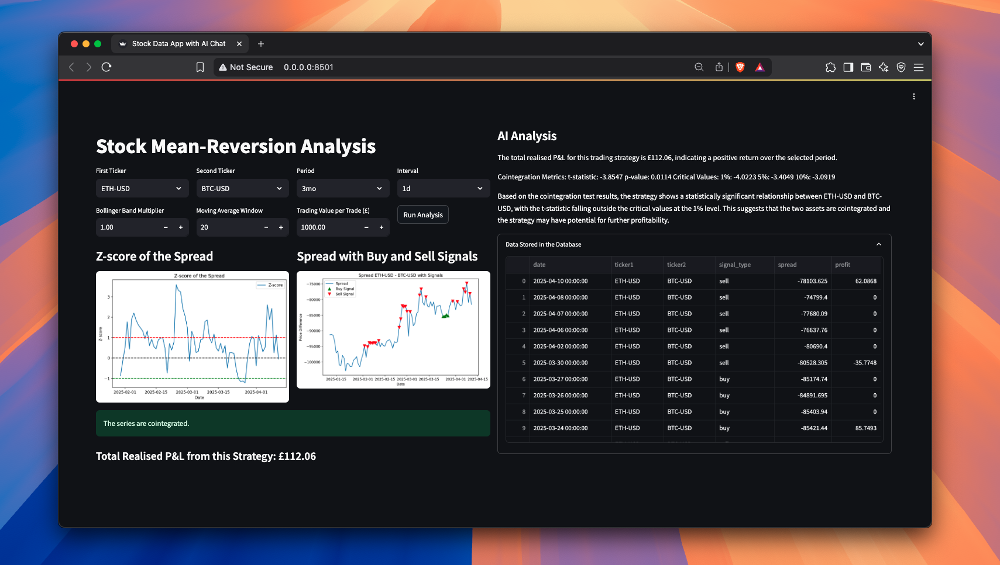

# Stock Mean-Reversion Analysis Dashboard with AI Chat Integration



An interactive dashboard built with [Streamlit](https://streamlit.io/) that performs a comprehensive stock pairs trading analysis. The tool leverages historical data, advanced statistical tests, real-world pairs trading simulation (including accurate profit and loss calculations), and an AI-powered strategy commentary. This project showcases your quantitative and full-stack development skills and is ideal for junior analysts or anyone interested in cutting-edge quantitative research and trading systems.

---

## Table of Contents

- [Overview](#overview)
- [Setup and Installation](#setup-and-installation)
  - [Clone the Repository](#clone-the-repository)
  - [Create a Python Virtual Environment](#create-a-python-virtual-environment)
  - [Install Dependencies](#install-dependencies)
  - [Configure Environment Variables](#configure-environment-variables)
- [Running the Dashboard](#running-the-dashboard)
  - [Using Docker](#using-docker)
  - [Running Locally](#running-locally)
- [How It Works](#how-it-works)
- [Value Provided](#value-provided)
- [Demo](#demo)
- [Conclusion](#conclusion)

---

## Overview

This dashboard performs stock mean-reversion analysis using a pairs trading strategy. Key features include:

- **Historical Data Retrieval:** Uses [yfinance](https://pypi.org/project/yfinance/) to download stock data.
- **Statistical Analysis:** Computes key metrics such as spread, moving averages, Bollinger Bands, and performs a cointegration test.
- **Signal Generation & Accurate P&L Calculation:** Generates buy/sell signals with realistic, notional trading simulation to compute profit and loss based on proper capital allocation.  
- **AI-Powered Insights:** Integrates with an AI chat solution (e.g., OpenAI Chat) to analyze strategy parameters and provide an executive summary.
- **Database Integration:** Stores trade signals and P&L data, facilitating further analysis and historical tracking.
- **Interactive Visualizations:** Offers easy-to-interpret plots of the Z-score and spread signals.

---

## Setup and Installation

### Clone the Repository

Start by cloning the repository to your local machine:

```bash
git clone https://github.com/your_username/your_repository_name.git
cd your_repository_name
